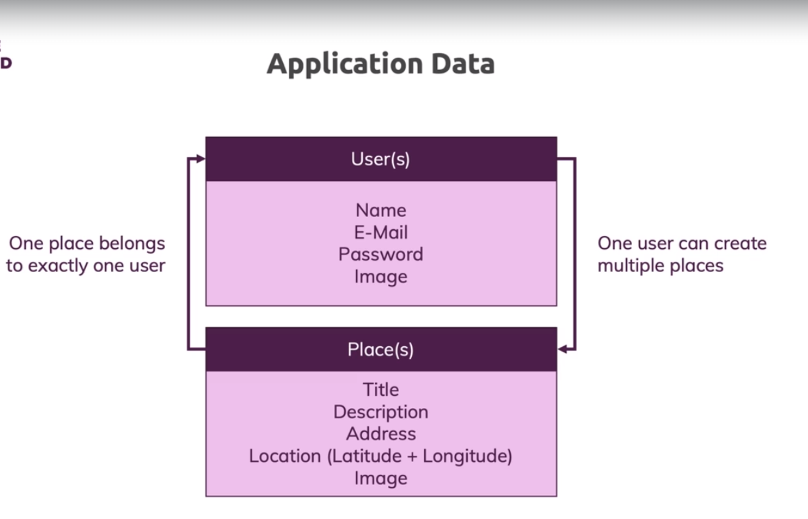
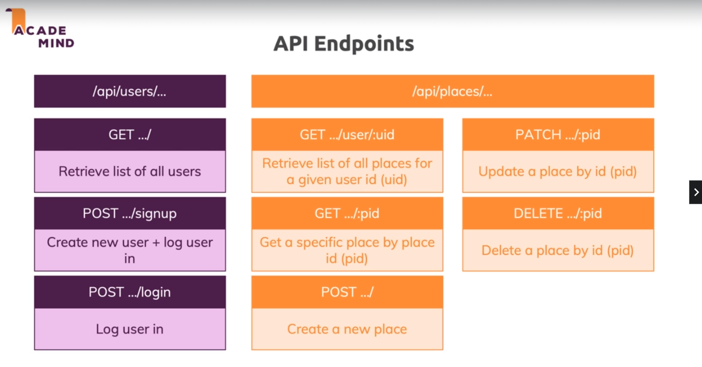

## project idea
- build app where users can share places with images and locations with other users;

- as user you can view list of users , click in user and then you see the places this user shared.

- we can create user 
 - create places 
  - get users ,get places , image uploading 
  - authentication , autherization 

## layout

## models

## endpoints

   